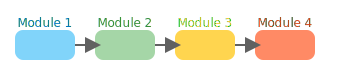

# FOMC Impact analysis

FUMCanalysis is a modular analysis toolkit designed for fast, flexible, and visually engaging data analysis workflows.

## Logo


## Features



### Easy Integration
## Installation

```bash
# Clone the repository
git clone https://github.com/SairajChowdhary/FUMCanalysis.git

# Install dependencies
cd FUMCanalysis
pip install -r requirements.txt
```

## Usage

```python
import fumcanalysis

# Example usage
fumcanalysis.run_analysis(data)
```

## License

MIT

---

For more information, see the source files and documentation.
